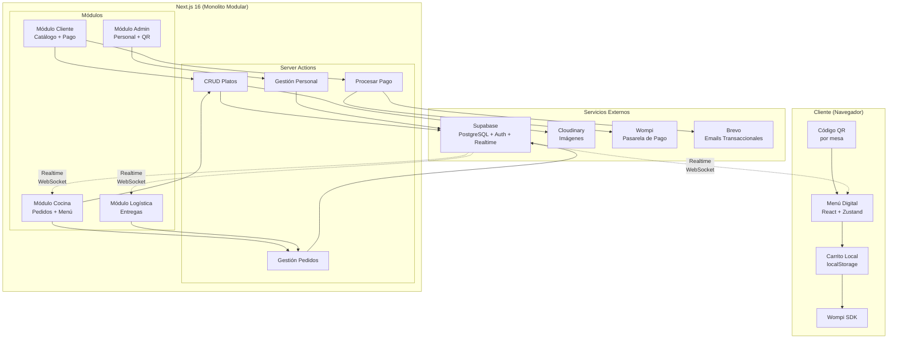

# 03 — Diagrama de Arquitectura

```mermaid
graph TB
    subgraph "Cliente (Navegador)"
        QR["Código QR<br/>por mesa"]
        MENU["Menú Digital<br/>React + Zustand"]
        CARRITO["Carrito Local<br/>localStorage"]
        PAGO["Wompi SDK"]
    end

    subgraph "Next.js 16 (Monolito Modular)"
        subgraph "Server Actions"
            SA_PLATOS["CRUD Platos"]
            SA_PEDIDOS["Gestión Pedidos"]
            SA_PAGO["Procesar Pago"]
            SA_PERSONAL["Gestión Personal"]
        end

        subgraph "Módulos"
            MOD_CLIENTE["Módulo Cliente<br/>Catálogo + Pago"]
            MOD_COCINA["Módulo Cocina<br/>Pedidos + Menú"]
            MOD_LOGISTICA["Módulo Logística<br/>Entregas"]
            MOD_ADMIN["Módulo Admin<br/>Personal + QR"]
        end
    end

    subgraph "Servicios Externos"
        SUPABASE["Supabase<br/>PostgreSQL + Auth + Realtime"]
        CLOUDINARY["Cloudinary<br/>Imágenes"]
        WOMPI["Wompi<br/>Pasarela de Pago"]
        BREVO["Brevo<br/>Emails Transaccionales"]
    end

    QR --> MENU
    MENU --> CARRITO
    CARRITO --> PAGO

    MOD_CLIENTE --> SA_PLATOS
    MOD_CLIENTE --> SA_PAGO
    MOD_COCINA --> SA_PLATOS
    MOD_COCINA --> SA_PEDIDOS
    MOD_LOGISTICA --> SA_PEDIDOS
    MOD_ADMIN --> SA_PERSONAL

    SA_PLATOS --> SUPABASE
    SA_PEDIDOS --> SUPABASE
    SA_PAGO --> WOMPI
    SA_PAGO --> BREVO
    SA_PERSONAL --> SUPABASE
    SA_PLATOS --> CLOUDINARY

    SUPABASE -.->|Realtime<br/>WebSocket| MENU
    SUPABASE -.->|Realtime<br/>WebSocket| MOD_COCINA
    SUPABASE -.->|Realtime<br/>WebSocket| MOD_LOGISTICA
```

**Leyenda:**
- Líneas sólidas: peticiones HTTP / Server Actions
- Líneas punteadas: suscripciones WebSocket (Supabase Realtime)
