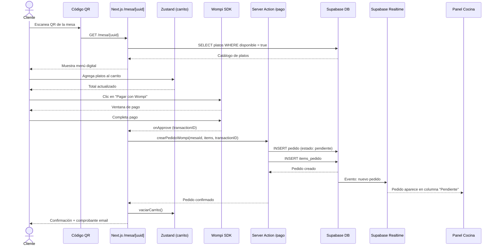
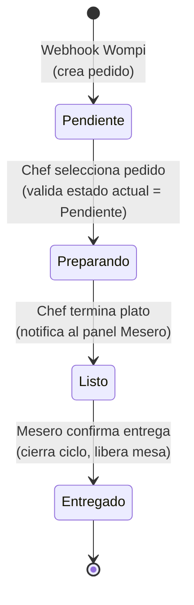

# 03 — Diagramas de Flujo

## Flujo 1: Compra del cliente



## Flujo 2: Ciclo de vida del pedido (State Pattern)



Ver reglas completas de transiciones (válidas e inválidas) en [`docs/04-patrones/state.md`](../04-patrones/state.md).

## Flujo 3: Actualización del catálogo (Observer Pattern)

```mermaid
sequenceDiagram
    actor CH as Chef
    participant UI as Panel Cocina /cocina/platos
    participant SA as Server Action
    participant CLD as Cloudinary
    participant DB as Supabase DB
    participant RT as Supabase Realtime
    participant CL as Menú Cliente /mesa/[uuid]

    CH->>UI: Crea/edita plato (con imagen)
    UI->>CLD: Sube imagen
    CLD-->>UI: URL optimizada
    UI->>SA: upsertPlato(datos + imagenUrl)
    SA->>DB: INSERT/UPDATE platos
    DB-->>SA: Plato guardado
    DB->>RT: Evento: cambio en platos
    RT-->>CL: Menú se actualiza sin recargar
    SA-->>UI: Confirmación

## Flujo 4: Seguimiento del pedido del cliente (Observer)

```mermaid
sequenceDiagram
    actor CL as Cliente
    participant APP as Next.js /mesa/[uuid]
    participant RT as Supabase Realtime
    participant DB as Supabase DB
    participant CK as Chef (Panel Cocina)

    CL->>APP: Pago completado, pedido creado
    APP->>RT: useMiPedidoRealtime(pedidoId)
    Note right of APP: Suscrito a UPDATE con filtro id=eq.{pedidoId}

    CK->>DB: UPDATE pedido SET estado = 'preparando'
    DB->>RT: Evento: cambio de estado
    RT-->>APP: onEstadoCambiado("preparando")
    APP-->>CL: "Tu pedido está siendo preparado"

    CK->>DB: UPDATE pedido SET estado = 'listo'
    DB->>RT: Evento: cambio de estado
    RT-->>APP: onEstadoCambiado("listo")
    APP-->>CL: "Tu pedido está listo"
```
```
