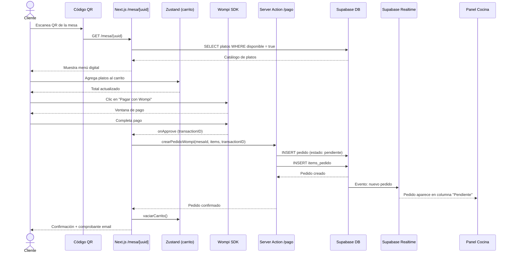
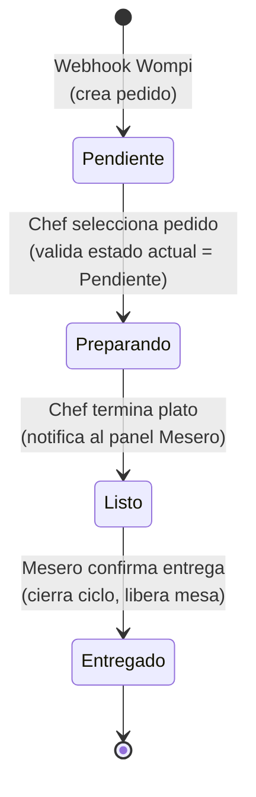
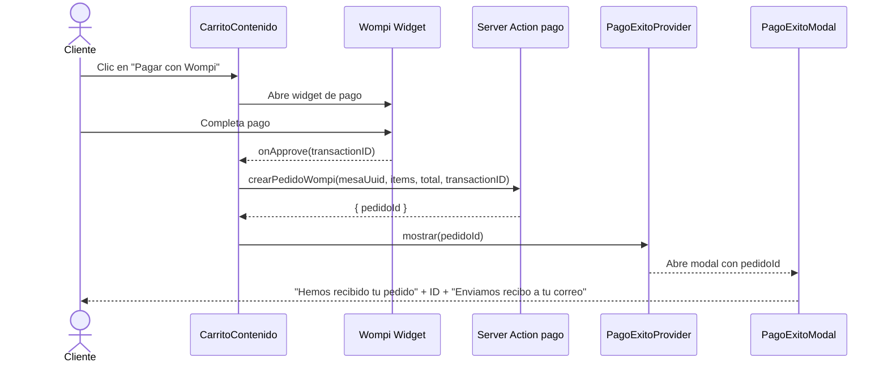

# 03 — Diagramas de Flujo

## Flujo 1: Compra del cliente



## Flujo 2: Ciclo de vida del pedido (State Pattern)



Ver reglas completas de transiciones (válidas e inválidas) en [`docs/04-patrones/state.md`](../04-patrones/state.md).

## Flujo 3: Actualización del catálogo (Observer Pattern)

```mermaid
sequenceDiagram
    actor CH as Chef
    participant UI as Panel Cocina /cocina/platos
    participant SA as Server Action
    participant CLD as Cloudinary
    participant DB as Supabase DB
    participant RT as Supabase Realtime
    participant CL as Menú Cliente /mesa/[uuid]

    CH->>UI: Crea/edita plato (con imagen)
    UI->>CLD: Sube imagen
    CLD-->>UI: URL optimizada
    UI->>SA: upsertPlato(datos + imagenUrl)
    SA->>DB: INSERT/UPDATE platos
    DB-->>SA: Plato guardado
    DB->>RT: Evento: cambio en platos
    RT-->>CL: Menú se actualiza sin recargar
    SA-->>UI: Confirmación

## Flujo 4: Seguimiento del pedido del cliente (Observer + Modal)

```mermaid
sequenceDiagram
    actor CL as Cliente
    participant MODAL as RastrearPedidoModal
    participant HOOK as useRastrearPedido
    participant SA as Server Action pedidoPublico
    participant RT as Supabase Realtime
    participant DB as Supabase DB
    participant CK as Chef (Panel Cocina)

    CL->>MODAL: Abre "Rastrear Pedido" desde barra superior
    CL->>MODAL: Ingresa ID del pedido (#66DF8CA2)
    MODAL->>HOOK: manejarBuscar()
    HOOK->>SA: obtenerEstadoPedidoPublico(id)
    SA->>DB: SELECT pedido WHERE id::text ILIKE prefijo
    DB-->>SA: Pedido encontrado (estado actual)
    SA-->>HOOK: Pedido { id, estado }
    HOOK->>RT: useMiPedidoRealtime(id)
    Note right of HOOK: Suscrito a UPDATE con filtro id=eq.{pedidoId}
    HOOK-->>MODAL: Estado "rastreando" + estado actual

    CK->>DB: UPDATE pedido SET estado = 'preparando'
    DB->>RT: Evento: cambio de estado
    RT-->>HOOK: onEstadoCambiado("preparando")
    HOOK-->>MODAL: Actualiza stepper + mensaje dinámico
    MODAL-->>CL: "Tu pedido está en preparación..."

    CK->>DB: UPDATE pedido SET estado = 'listo'
    DB->>RT: Evento: cambio de estado
    RT-->>HOOK: onEstadoCambiado("listo")
    HOOK-->>MODAL: Actualiza stepper + mensaje dinámico
    MODAL-->>CL: "Tu pedido está listo. Pronto te lo entregarán."

    CK->>DB: UPDATE pedido SET estado = 'entregado'
    DB->>RT: Evento: cambio de estado
    RT-->>HOOK: onEstadoCambiado("entregado")
    HOOK-->>MODAL: Estado "entregado"
    MODAL-->>CL: GIF chefsito despidiéndose + "Pedido Entregado"
```

## Flujo 5: Confirmación de pago exitoso (PagoExitoModal)


```
