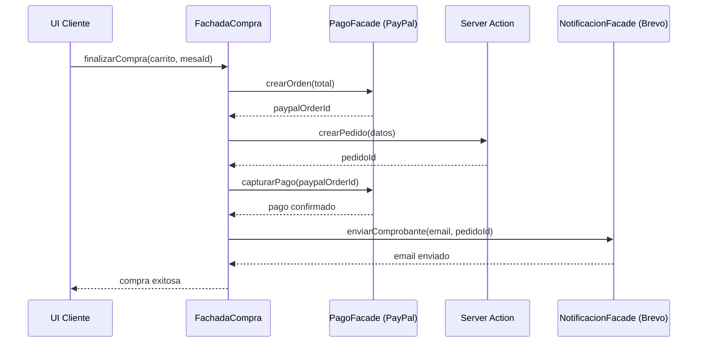

# 04 — Facade Pattern

## Concepto

El patrón Facade proporciona una interfaz unificada para un conjunto de interfaces en un subsistema. Define un punto de entrada de nivel superior que hace que el subsistema sea más fácil de usar.

## Aplicación en E-Kitchen

Tres servicios externos requieren integración: **PayPal** (pagos), **Cloudinary** (imágenes) y **Brevo** (emails). Cada uno tiene su propia API, autenticación y manejo de errores. El Facade centraliza estas interacciones para que el resto de la aplicación no dependa directamente de ellas.

### Fachadas implementadas

| Fachada | Archivo | Servicio | Estado | Métodos expuestos |
|---|---|---|---|---|
| `MediaFacade` | `src/lib/servicios/mediaFacade.ts` | Cloudinary | ✅ **Implementado** | `subirImagen()`, `eliminarImagen()`, `firmarParametros()` |
| `PagoFacade` | `src/lib/servicios/_PagoFacade.ts` | PayPal | 🔜 Esqueleto (TODO) | `crearOrden()`, `capturarPago()` |
| `NotificacionFacade` | `src/lib/servicios/_NotificacionFacade.ts` | Brevo | 🔜 Esqueleto (TODO) | `enviarComprobante()`, `enviarAvisoCocina()` |

> **Nota:** Los archivos con prefijo `_` (ej: `_PagoFacade.ts`) son esqueletos listos para implementar. Las interfaces, métodos y tipos ya están definidos. Solo falta integrar los SDKs correspondientes.

### MediaFacade — Implementación real

| Método | Descripción | ¿Quién lo usa? |
|---|---|---|
| `subirImagen(buffer, opciones)` | Sube una imagen a Cloudinary y devuelve la URL | `acciones/imagenes.ts` → `subirImagenPlato()` |
| `eliminarImagen(publicId)` | Elimina una imagen de Cloudinary | No usado aún |
| `firmarParametros(parametros)` | Firma parámetros para upload directo desde el cliente | No usado aún |

```typescript
// src/lib/acciones/imagenes.ts — uso real de MediaFacade
const buffer = Buffer.from(await archivo.arrayBuffer());
const resultado = await MediaFacade.subirImagen(buffer, {
  folder: "e-kitchen/platos",
});
return resultado.secureUrl;
```

### PagoFacade — Esqueleto (listo para PayPal)

```typescript
// src/lib/servicios/_PagoFacade.ts
export class PagoFacade {
  static async crearOrden(total: number): Promise<ResultadoOperacion<string>> {
    // TODO: Integrar SDK de PayPal
    // 1. Autenticar con OAuth2
    // 2. POST /v2/checkout/orders
    // 3. Retornar orderID
  }

  static async capturarPago(ordenId: string): Promise<ResultadoOperacion<OrdenPago>> {
    // TODO: POST /v2/checkout/orders/{ordenId}/capture
  }
}
```

### NotificacionFacade — Esqueleto (listo para Brevo)

```typescript
// src/lib/servicios/_NotificacionFacade.ts
export class NotificacionFacade {
  static async enviarComprobante(email, pedidoId, total): Promise<ResultadoOperacion> {
    // TODO: Integrar SDK de Brevo
    // Usar template "comprobante de compra"
  }

  static async enviarAvisoCocina(email, pedidoId): Promise<ResultadoOperacion> {
    // TODO: Usar template "pedido listo"
  }
}
```

### Diagrama de integración (cuando esté completo)



### Beneficio clave

Si mañana se cambia PayPal por Stripe, o Brevo por SendGrid, **solo se modifica la fachada correspondiente**. El resto del código (UI, Server Actions, lógica de negocio) no se toca. Los archivos con prefijo `_` están diseñados para que al implementar el SDK real, solo haya que rellenar los métodos sin cambiar la interfaz.
