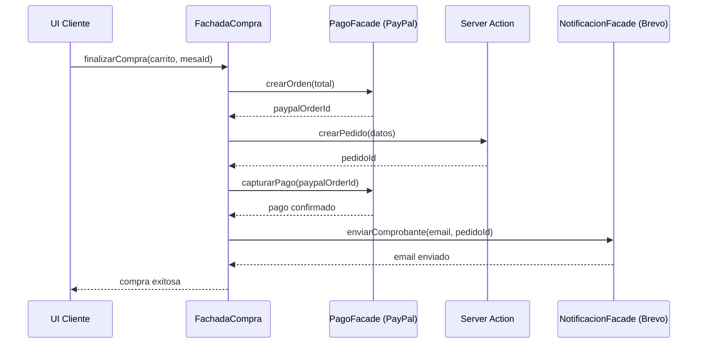

# 04 — Facade Pattern

## Concepto

El patrón Facade proporciona una interfaz unificada para un conjunto de interfaces en un subsistema. Define un punto de entrada de nivel superior que hace que el subsistema sea más fácil de usar.

## Aplicación en E-Kitchen

Tres servicios externos requieren integración: **PayPal** (pagos), **Cloudinary** (imágenes) y **Brevo** (emails). Cada uno tiene su propia API, autenticación y manejo de errores. El Facade centraliza estas interacciones para que el resto de la aplicación no dependa directamente de ellas.

### Fachadas implementadas

| Fachada | Servicio | Métodos expuestos | ¿Qué oculta? |
|---|---|---|---|
| `PagoFacade` | PayPal | `crearOrden()`, `capturarPago()` | Autenticación OAuth2 de PayPal, reintentos, manejo de errores |
| `MediaFacade` | Cloudinary | `subirImagen()`, `eliminarImagen()` | Configuración de upload, firmas, transformaciones de imagen |
| `NotificacionFacade` | Brevo | `enviarComprobante()`, `enviarAvisoCocina()` | Templates de email, API key, manejo de bounces |

### Ejemplo: Flujo de "Finalizar Compra"

La UI solo llama a `FachadaCompra.finalizarCompra()`. No necesita saber nada sobre OAuth de PayPal, estructura de emails de Brevo ni el formato de la respuesta.

### Referencia en el código

- **Tabla platos:** `src/lib/db/schema.ts:49` — columna `imagenUrl` (URL de Cloudinary guardada)
- **Tabla pedidos:** `src/lib/db/schema.ts:72-73` — columnas `total` y `paypalPedidoId`
- Las fachadas se implementan en `src/lib/services/` como módulos independientes

### Beneficio clave

Si mañana se cambia PayPal por Stripe, o Brevo por SendGrid, solo se modifica la fachada correspondiente. El resto del código (UI, Server Actions, lógica de negocio) no se toca.
