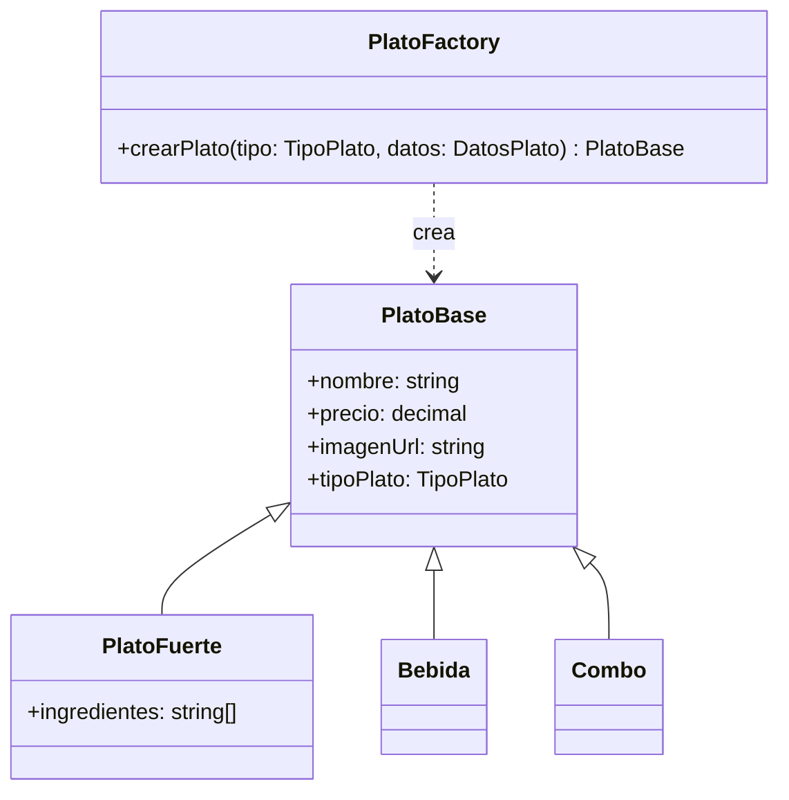

# 04 — Factory Method Pattern

## Concepto

El patrón Factory Method define una interfaz para crear un objeto, pero delega a las subclases la decisión de qué clase concreta instanciar. Permite que una clase difiera la instanciación a sus subclases.

## Aplicación en E-Kitchen

En el panel de Cocina, el chef puede crear 3 tipos de plato: **Plato Fuerte**, **Bebida** y **Combo**. Cada tipo comparte campos base (nombre, precio, imagen) pero tiene diferencias en su estructura.

### Jerarquía de productos

| Tipo de Plato | Atributos específicos |
|---|---|
| Plato Fuerte | Ingredientes obligatorios (mínimo 2) |
| Bebida | Sin ingredientes |
| Combo | Sin ingredientes |

### Cómo funciona

1. El chef selecciona el tipo de plato en el formulario
2. El Factory Method instancia la clase concreta según el tipo
3. Se renderizan campos específicos para ese tipo
4. Los campos comunes se comparten en una interfaz base

### Referencia en el código

- **Enum de tipos:** `src/lib/db/schema.ts:21-25` — `tipoPlatoEnum` (`plato_fuerte`, `bebida`, `combo`)
- **Tabla platos:** `src/lib/db/schema.ts:44-57` — columna `tipoPlato` determina qué tipo de plato se crea
- **Tipos del dominio:** `src/types/index.ts:5` — `TipoPlato` usado para tipar el factory
- **Formulario de creación:** se implementa en `/cocina/platos` con renderizado condicional según `tipoPlato`

### Diagrama

El Factory expone un único método `crearPlato` que recibe el tipo y devuelve la instancia correcta, ocultando la lógica de creación al componente de UI.
