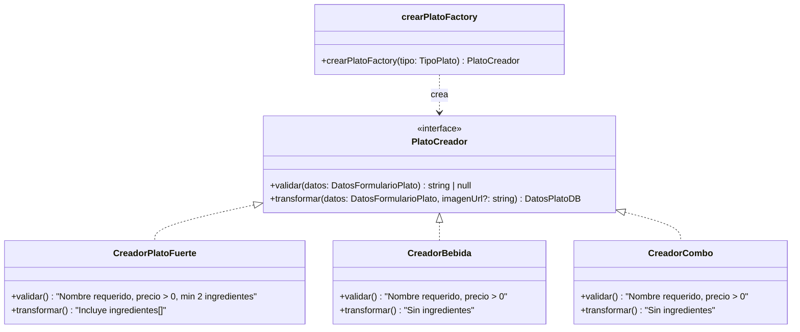

# 04 — Factory Method Pattern

## Concepto

El patrón Factory Method define una interfaz para crear un objeto, pero delega a las subclases la decisión de qué clase concreta instanciar. Permite que una clase difiera la instanciación a sus subclases.

## Aplicación en E-Kitchen

En el panel de Cocina, el chef puede crear 3 tipos de plato: **Plato Fuerte**, **Bebida** y **Combo**. Cada tipo comparte campos base (nombre, precio, imagen) pero tiene diferencias en su validación y estructura.

### Jerarquía de productos

| Tipo de Plato | Clase creadora | Validación específica |
|---|---|---|
| Plato Fuerte | `CreadorPlatoFuerte` | Requiere al menos 2 ingredientes |
| Bebida | `CreadorBebida` | Sin ingredientes, precio > 0 |
| Combo | `CreadorCombo` | Sin ingredientes, precio > 0 |

### Cómo funciona

1. El chef selecciona el tipo de plato en el formulario
2. El hook `useGestionPlatos` llama a `crearPlatoFactory(tipo)`
3. El Factory devuelve el `Creador` concreto según el tipo
4. Se ejecuta `creador.validar(datos)` — si falla, muestra error en el formulario
5. Si pasa validación, `creador.transformar(datos)` genera los datos para la BD
6. Se llama a la Server Action `crearPlato`

### Referencia en el código

| Componente | Archivo | Descripción |
|---|---|---|
| **Factory** | `src/lib/servicios/platoFactory.ts` | Define la interfaz `PlatoCreador`, las 3 clases concretas y la función `crearPlatoFactory(tipo)` |
| **Hook integrador** | `src/hooks/useGestionPlatos.ts:20-23` | Llama al Factory para validar antes de crear el plato |
| **Enum de tipos** | `src/lib/db/schema.ts` | `tipoPlatoEnum` (`plato_fuerte`, `bebida`, `combo`) |
| **Tipos del dominio** | `src/types/index.ts` | `TipoPlato` usado para tipar el factory |
| **Formulario** | `src/components/cocina/FormularioPlato.tsx` | Renderizado condicional de ingredientes según `tipoPlato` |

### Diagrama

### Aplicación del principio OCP (Open/Closed)

El Factory está **abierto a extensión** pero **cerrado a modificación**. Para agregar un nuevo tipo de plato (ej: "Postre"):

1. Crear `class CreadorPostre implements PlatoCreador`
2. Agregar `postre: new CreadorPostre()` al mapa `CREADORES`
3. Agregar `"postre"` al enum `TipoPlato`

No se modifica ninguna clase existente. Solo se añade código nuevo.
