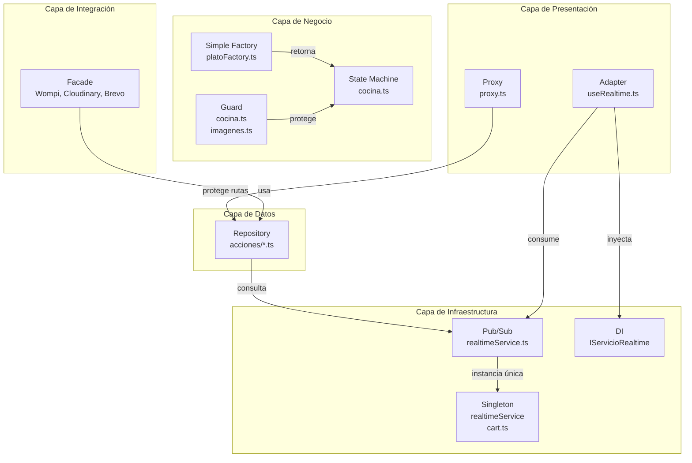

# 04 — Patrones de Diseño: Índice

El proyecto integra **10 patrones de diseño** distribuidos en 4 categorías, operando en distintos niveles de la arquitectura (UI, lógica de negocio, integración, infraestructura).

---

## Resumen

| # | Patrón | Tipo | ¿Dónde actúa? | ¿Qué resuelve? | Archivo principal |
|---|---|---|---|---|---|
| 1 | **Pub/Sub** | Comportamiento | Capa de datos → UI | Sincronización en tiempo real sin polling | `src/lib/servicios/realtimeService.ts` |
| 2 | **Guard** | Comportamiento | Lógica de negocio | Validaciones secuenciales antes de ejecutar acciones | `src/lib/acciones/cocina.ts`, `src/lib/acciones/imagenes.ts` |
| 3 | **State Machine** | Comportamiento | Lógica de negocio | Transiciones válidas del ciclo de vida del pedido | `src/lib/acciones/cocina.ts` |
| 4 | **Singleton** | Creacional | Infraestructura | Instancia única global | `src/lib/servicios/realtimeService.ts`, `src/stores/cart.ts` |
| 5 | **Simple Factory** | Creacional | Lógica de negocio | Creación parametrizada de validadores por tipo de plato | `src/lib/servicios/platoFactory.ts` |
| 6 | **Facade** | Estructural | Integraciones externas | Simplificar APIs de Wompi, Cloudinary y Brevo | `src/lib/servicios/PagoFacade.ts`, `mediaFacade.ts`, `NotificacionFacade.ts` |
| 7 | **Adapter** | Estructural | Infraestructura React | Adaptar WebSocket de Supabase al ciclo de vida de React | `src/hooks/useRealtime.ts` |
| 8 | **Proxy** | Estructural | Capa HTTP | Proteger rutas del staff con autenticación y roles | `src/proxy.ts` |
| 9 | **Repository** | Arquitectónico | Acceso a datos | Encapsular queries por dominio, separar BD de la UI | `src/lib/acciones/*.ts` |
| 10 | **DI** | Arquitectónico | Infraestructura | Permitir testing con mocks inyectables | `src/hooks/useRealtime.ts` |

---

## Navegación por tipo

| Tipo | Patrones |
|---|---|
| [Comportamiento](comportamiento/) | Pub/Sub, Guard, State Machine |
| [Creacional](creacional/) | Singleton, Simple Factory |
| [Estructural](estructural/) | Facade, Adapter, Proxy |
| [Arquitectónico](arquitectonico/) | Repository, Dependency Injection |

---

## Relación con principios SOLID

| Patrón | Principio SOLID | Cómo se aplica |
|---|---|---|
| **Simple Factory** | OCP | Nuevos tipos de plato sin modificar el factory |
| **Singleton** | SRP | Cada singleton tiene una sola responsabilidad |
| **Facade** | SRP | Cada fachada tiene una sola razón de cambiar (un servicio externo) |
| **Repository** | SRP | Cada archivo de acciones encapsula un dominio |
| **Adapter** | ISP | `IServicioRealtime` expone solo los métodos necesarios |
| **DI** | DIP | Componentes dependen de abstracciones (`IServicioRealtime`), no de implementaciones concretas |

---

## Cómo se relacionan los patrones

