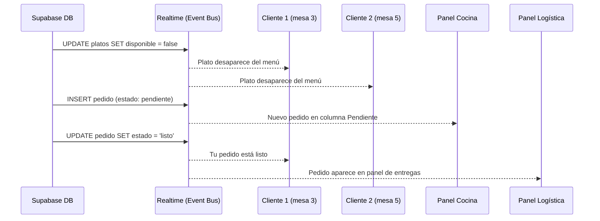

# 04 — Observer Pattern

## Concepto

El patrón Observer define una dependencia uno-a-muchos entre objetos. Cuando un objeto (sujeto) cambia de estado, todos sus dependientes (observadores) son notificados automáticamente.

## Aplicación en E-Kitchen

Supabase Realtime actúa como el **sujeto observable**. Cada cambio en la base de datos (INSERT, UPDATE, DELETE) emite un evento por WebSocket. Los clientes suscritos (panel de cocina, menú del cliente, panel de logística) actúan como **observadores**.

### ¿Qué observa cada módulo?

| Observador | Suscripción | Evento |
|---|---|---|
| Menú Cliente | `platos` | Cambios en el catálogo (precio, disponibilidad, nuevo plato) |
| Panel Cocina | `pedidos` | Nuevos pedidos (`estado = pendiente`) |
| Panel Mesero | `pedidos` | Pedidos listos (`estado = listo`) |
| Cliente (estado) | `pedidos` (filtrado por ID) | Cambio de estado de su propio pedido |

### Diagrama

## Referencia en el código

- **Schema de pedidos:** `src/lib/db/schema.ts:66-77` — tabla `pedidos` con columna `estado`
- **Cliente Supabase browser:** `src/lib/supabase/browser.ts:3-8` — `createBrowserClient` gestiona la conexión WebSocket
- **Suscripción Realtime:** se implementa en los componentes cliente de cada panel usando `supabase.channel().on('postgres_changes', ...).subscribe()`
