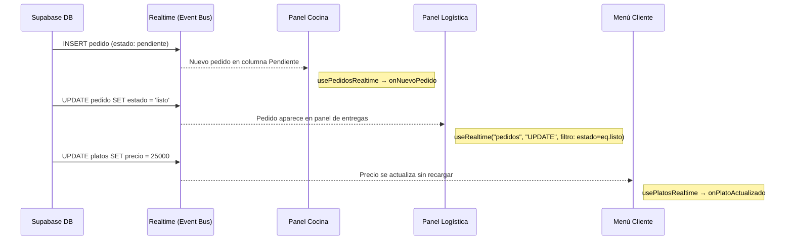

# 04 — Observer Pattern

## Concepto

El patrón Observer define una dependencia uno-a-muchos entre objetos. Cuando un objeto (sujeto) cambia de estado, todos sus dependientes (observadores) son notificados automáticamente.

## Aplicación en E-Kitchen

Supabase Realtime actúa como el **sujeto observable**. Cada cambio en la base de datos (INSERT, UPDATE, DELETE) emite un evento por WebSocket. Los clientes suscritos (panel de cocina, panel de logística, menú del cliente) actúan como **observadores**.

### ¿Qué observa cada módulo?

| Observador | Suscripción | Evento | Hook | Implementado |
|---|---|---|---|---|
| Panel Cocina | `pedidos` | Nuevos pedidos + cambios de estado | `usePedidosRealtime` | ✅ `INSERT` + `UPDATE` |
| Panel Mesero | `pedidos` | Pedidos listos (`estado = listo`) | `useRealtime` con filtro `estado=eq.listo` | ✅ |
| Stats Bar | `pedidos` | Todos los cambios (contadores) | `useRealtime("*")` | ✅ |
| Menú Cliente | `platos` | Cambios en el catálogo (precio, disponibilidad, nuevo plato) | `usePlatosRealtime` | ✅ |
| Cliente (estado) | `pedidos` (filtrado por ID) | Cambio de estado de su propio pedido | `useMiPedidoRealtime` | ✅ |

### Referencia en el código

| Componente | Archivo | Descripción |
|---|---|---|
| **Servicio de Realtime** | `src/lib/servicios/realtimeService.ts` | Abstracción DIP del canal WebSocket. Interfaz `IServicioRealtime` + implementación `SupabaseRealtimeService`. Factory `crearRealtimeService()` |
| **Hook genérico** | `src/hooks/useRealtime.ts` | Infraestructura: recibe `IServicioRealtime` inyectable, gestiona ciclo de vida React ↔ servicio |
| **Hook de negocio (pedidos)** | `src/hooks/usePedidosRealtime.ts` | Suscribe INSERT + UPDATE en pedidos, fetchea items automáticamente. Callbacks: `onNuevoPedido`, `onCambioEstado`, `onPedidoEntregado` |
| **Hook de negocio (platos)** | `src/hooks/usePlatosRealtime.ts` | Suscribe INSERT + UPDATE + DELETE en platos. Callbacks: `onNuevoPlato`, `onPlatoActualizado`, `onPlatoEliminado` |
| **Hook de negocio (mi pedido)** | `src/hooks/useMiPedidoRealtime.ts` | Suscribe UPDATE en pedidos filtrado por ID. Callback: `onEstadoCambiado` |
| **Panel Cocina** | `src/components/cocina/kanbanPedidos.tsx:28` | Usa `usePedidosRealtime()` para recibir nuevos pedidos y cambios de estado |
| **Stats Bar** | `src/components/cocina/statsBar.tsx:18` | Usa `useRealtime("*")` para actualizar contadores en tiempo real |
| **Panel Logística** | `src/components/logistica/listaEntregas.tsx:31` | Usa `useRealtime("UPDATE", filtro: estado=eq.listo)` para recibir pedidos listos |

### Diagrama



### Cómo funciona `useRealtime`

```typescript
// src/hooks/useRealtime.ts
export function useRealtime(
  tabla: string,
  evento: EventoRealtime,   // "INSERT" | "UPDATE" | "DELETE" | "*"
  callback: (payload: RealtimePostgresChangesPayload) => void,
  filtro?: string,          // PostgREST filter (ej: "estado=eq.listo")
  servicio?: IServicioRealtime  // DIP: inyectable para testing
) {
  const callbackRef = useRef(callback);
  useEffect(() => { callbackRef.current = callback; });

  const [svc] = useState(() => servicio ?? crearRealtimeService());

  useEffect(() => {
    let activo = true;
    let suscripcionVigente: ISuscripcionRealtime | null = null;

    svc.suscribir(
      { tabla, evento, filtro, schema: "public" },
      (payload) => { if (activo) callbackRef.current(payload); }
    ).then((suscripcion) => {
      if (activo) suscripcionVigente = suscripcion;
      else suscripcion.cancelar();
    });

    return () => {
      activo = false;
      if (suscripcionVigente) suscripcionVigente.cancelar();
    };
  }, [svc, tabla, evento, filtro]);
}
```

El hook:
1. Crea un canal WebSocket con Supabase a través de `IServicioRealtime` (DIP)
2. Obtiene la sesión y configura `setAuth()` antes de suscribir (sin race condition)
3. Se suscribe a cambios en la tabla especificada (`postgres_changes`) con filtro opcional
4. Ejecuta el callback cada vez que ocurre un cambio (usando ref para evitar re-suscripciones)
5. Limpia la suscripción al desmontar el componente, incluso si la promesa no se ha resuelto

### Servicio de Realtime (DIP)

```typescript
// src/lib/servicios/realtimeService.ts
export interface IServicioRealtime {
  suscribir<TRow>(opciones: OpcionesSuscripcion, callback: CallbackCambio<TRow>): Promise<ISuscripcionRealtime>;
  desconectarTodo(): Promise<void>;
}

export interface ISuscripcionRealtime {
  cancelar: () => Promise<void>;
}

export class SupabaseRealtimeService implements IServicioRealtime {
  async suscribir<TRow>(opciones, callback): Promise<ISuscripcionRealtime> {
    const supabase = crearCliente();
    const { data: { session } } = await supabase.auth.getSession();
    if (session?.access_token) supabase.realtime.setAuth(session.access_token);  // auth antes del canal

    const canal = supabase
      .channel(`rt-${opciones.tabla}-${opciones.evento}-${Date.now()}`)
      .on("postgres_changes", { event, schema, table, filter }, callback)
      .subscribe();

    return { cancelar: () => supabase.removeChannel(canal) };
  }
}
```

### Beneficio clave

Sin Observer, los paneles de cocina y logística necesitarían **polling** (recargar la página cada N segundos). Con Realtime, los cambios aparecen instantáneamente sin recarga manual, eliminando latencia entre que el cliente pide y el cocinero ve.

### SOLID aplicado

- **SRP**: `useRealtime` solo maneja ciclo de vida React; `SupabaseRealtimeService` solo maneja canales Supabase
- **OCP**: Nuevos hooks (`usePlatosRealtime`, `useMiPedidoRealtime`) sin modificar `useRealtime`
- **DIP**: Componentes y hooks dependen de `IServicioRealtime` (abstracción), no de `crearCliente()` (concreto)
- **ISP**: `IServicioRealtime` expone solo `suscribir()` y `desconectarTodo()`
