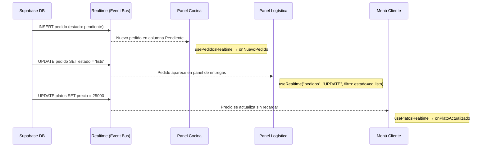

# 04 — Observer Pattern

## Concepto

El patrón Observer define una dependencia uno-a-muchos entre objetos. Cuando un objeto (sujeto) cambia de estado, todos sus dependientes (observadores) son notificados automáticamente.

## Aplicación en E-Kitchen

Supabase Realtime actúa como el **sujeto observable**. Cada cambio en la base de datos (INSERT, UPDATE, DELETE) emite un evento por WebSocket. Los clientes suscritos (panel de cocina, panel de logística, menú del cliente) actúan como **observadores**.

### ¿Qué observa cada módulo?

| Observador | Suscripción | Evento | Hook | Implementado |
|---|---|---|---|---|---|
| Panel Cocina | `pedidos` | Nuevos pedidos + cambios de estado | `usePedidosRealtime` | ✅ `INSERT` + `UPDATE` |
| Panel Mesero | `pedidos` | Pedidos listos (`estado = listo`) | `useEntregaPedidos` | ✅ `UPDATE` con filtro `estado=eq.listo` |
| Stats Bar | `pedidos` | Todos los cambios (contadores) | `useRealtime` en `statsBar.tsx` | ✅ `INSERT` + `UPDATE` + `DELETE` |
| Menú Cliente | `platos` | Cambios en el catálogo (precio, disponibilidad, nuevo plato) | `usePlatosRealtime` | ✅ `INSERT` + `UPDATE` + `DELETE` |
| Cliente (estado) | `pedidos` (filtrado por ID) | Cambio de estado de su propio pedido | `useMiPedidoRealtime` | ✅ `UPDATE` con filtro `id=eq.{pedidoId}` |

### Referencia en el código

| Componente | Archivo | Descripción |
|---|---|---|
| **Servicio de Realtime** | `src/lib/servicios/realtimeService.ts` | Abstracción DIP del canal WebSocket. Interfaz `IServicioRealtime` + implementación `SupabaseRealtimeService`. Factory `crearRealtimeService()` |
| **Hook genérico** | `src/hooks/useRealtime.ts` | Infraestructura: recibe `IServicioRealtime` inyectable, gestiona ciclo de vida React ↔ servicio |
| **Hook de negocio (pedidos)** | `src/hooks/usePedidosRealtime.ts` | Suscribe INSERT + UPDATE en pedidos, fetchea items automáticamente. Callbacks: `onNuevoPedido`, `onCambioEstado`, `onPedidoEntregado` |
| **Hook de negocio (platos)** | `src/hooks/usePlatosRealtime.ts` | Suscribe INSERT + UPDATE + DELETE en platos. Callbacks: `onNuevoPlato`, `onPlatoActualizado`, `onPlatoEliminado` |
| **Hook de negocio (mi pedido)** | `src/hooks/useMiPedidoRealtime.ts` | Suscribe UPDATE en pedidos filtrado por ID. Callback: `onEstadoCambiado` |
| **Hook de negocio (logística)** | `src/hooks/useEntregaPedidos.ts` | Suscribe UPDATE en pedidos con filtro `estado=eq.listo`. Callback: actualiza lista de entregas |
| **Panel Cocina** | `src/components/cocina/kanbanPedidos.tsx` | Usa `usePedidosRealtime()` para recibir nuevos pedidos y cambios de estado |
| **Stats Bar** | `src/components/cocina/statsBar.tsx` | Usa `useRealtime` con INSERT + UPDATE + DELETE para actualizar contadores |
| **Panel Logística** | `src/components/logistica/listaEntregas.tsx` | Usa `useEntregaPedidos()` para recibir pedidos listos y confirmar entregas |

### Diagrama



### Cómo funciona `useRealtime`

```typescript
// src/hooks/useRealtime.ts
export function useRealtime(
  tabla: string,
  evento: EventoRealtime,   // "INSERT" | "UPDATE" | "DELETE" | "*"
  callback: (payload: RealtimePostgresChangesPayload) => void,
  filtro?: string,          // PostgREST filter (ej: "estado=eq.listo")
  servicio?: IServicioRealtime  // DIP: inyectable para testing
) {
  const callbackRef = useRef(callback);
  useEffect(() => { callbackRef.current = callback; });

  const [svc] = useState(() => servicio ?? crearRealtimeService());

  useEffect(() => {
    let activo = true;
    let suscripcionVigente: ISuscripcionRealtime | null = null;

    svc.suscribir(
      { tabla, evento, filtro, schema: "public" },
      (payload) => { if (activo) callbackRef.current(payload); }
    ).then((suscripcion) => {
      if (activo) suscripcionVigente = suscripcion;
      else suscripcion.cancelar();
    });

    return () => {
      activo = false;
      if (suscripcionVigente) suscripcionVigente.cancelar();
    };
  }, [svc, tabla, evento, filtro]);
}
```

El hook:
1. Crea un canal WebSocket con Supabase a través de `IServicioRealtime` (DIP)
2. Obtiene la sesión y configura `setAuth()` manualmente antes de crear el canal, difiriendo al próximo macrotask para mitigar el race condition con `onAuthStateChange` interno de Supabase
3. Se suscribe a cambios en la tabla especificada (`postgres_changes`) con filtro opcional
4. Ejecuta el callback cada vez que ocurre un cambio (usando ref para evitar re-suscripciones)
5. Limpia la suscripción al desmontar el componente, incluso si la promesa no se ha resuelto

### Race condition conocido: `setAuth()` y `onAuthStateChange`

Supabase internamente escucha `onAuthStateChange` y dispara `realtime.setAuth()` de forma asíncrona. Si esto ocurre después de que los canales ya fueron creados, el WebSocket se desconecta/reconecta, cerrando los canales (`CLOSED`). La mitigación implementada en `SupabaseRealtimeService.suscribir()`:
1. Llama `getSession()` + `setAuth()` manualmente antes de crear el canal
2. Usa un contador atómico en el nombre del canal (`rt-{tabla}-{evento}-{contador}-{timestamp}`) para evitar colisiones entre mounts de Strict Mode

### Servicio de Realtime (DIP)

```typescript
// src/lib/servicios/realtimeService.ts
export interface IServicioRealtime {
  suscribir<TRow>(opciones: OpcionesSuscripcion, callback: CallbackCambio<TRow>): Promise<ISuscripcionRealtime>;
  desconectarTodo(): Promise<void>;
}

export interface ISuscripcionRealtime {
  cancelar: () => Promise<void>;
}

export class SupabaseRealtimeService implements IServicioRealtime {
  async suscribir<TRow>(opciones, callback): Promise<ISuscripcionRealtime> {
    const supabase = crearCliente();

    // Forzar carga de sesión y mitigar race condition con onAuthStateChange
    const { data: { session } } = await supabase.auth.getSession();
    if (session?.access_token) supabase.realtime.setAuth(session.access_token);

    // Nombre único con contador para evitar colisiones entre mounts
    this.contadorCanales++;
    const nombre = `rt-${opciones.tabla}-${opciones.evento}-${this.contadorCanales}-${Date.now()}`;

    const canal = supabase
      .channel(nombre)
      .on("postgres_changes", { event, schema, table, filter }, callback)
      .subscribe();

    return { cancelar: () => supabase.removeChannel(canal) };
  }
}
```

### Beneficio clave

Sin Observer, los paneles de cocina y logística necesitarían **polling** (recargar la página cada N segundos). Con Realtime, los cambios aparecen instantáneamente sin recarga manual, eliminando latencia entre que el cliente pide y el cocinero ve.

### Race condition: pedido vs items_pedido

Cuando un cliente paga, `crearPedidoWompi` ejecuta dos INSERT secuenciales:

```
1. INSERT INTO pedidos ...       ← Realtime emite evento inmediatamente
2. INSERT INTO items_pedido ...  ← ~50-200ms después (latencia de red)
```

El hook `usePedidosRealtime` recibe el evento en el paso 1, pero los items aún no existen. Para resolverlo:

1. **Retry con backoff**: `obtenerPedidoConReintento()` reintenta hasta 2 veces (200ms, 400ms) si los items no están disponibles
2. **Server Action**: La consulta de items se delegó a `obtenerItemsPorPedido()` (Server Action) que corre del lado del servidor, donde la sesión del staff está garantizada y RLS permite el SELECT anidado en `platos`
3. **PostgREST FK embedding**: Como `items_pedido → platos` es many-to-one, PostgREST devuelve `platos` como objeto `{ nombre: "..." }`, no como array. Se accede con `item.platos?.nombre`, nunca con `item.platos?.[0]?.nombre`

### SOLID aplicado

- **SRP**: `useRealtime` solo maneja ciclo de vida React; `SupabaseRealtimeService` solo maneja canales Supabase
- **OCP**: Nuevos hooks (`usePlatosRealtime`, `useMiPedidoRealtime`) sin modificar `useRealtime`
- **DIP**: Componentes y hooks dependen de `IServicioRealtime` (abstracción), no de `crearCliente()` (concreto)
- **ISP**: `IServicioRealtime` expone solo `suscribir()` y `desconectarTodo()`
