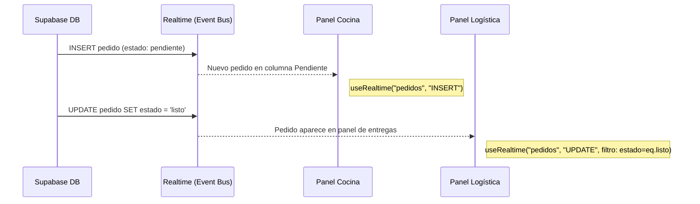

# 04 — Observer Pattern

## Concepto

El patrón Observer define una dependencia uno-a-muchos entre objetos. Cuando un objeto (sujeto) cambia de estado, todos sus dependientes (observadores) son notificados automáticamente.

## Aplicación en E-Kitchen

Supabase Realtime actúa como el **sujeto observable**. Cada cambio en la base de datos (INSERT, UPDATE, DELETE) emite un evento por WebSocket. Los clientes suscritos (panel de cocina, panel de logística) actúan como **observadores**.

### ¿Qué observa cada módulo?

| Observador | Suscripción | Evento | Implementado |
|---|---|---|---|
| Panel Cocina | `pedidos` | Nuevos pedidos (`estado = pendiente`) | ✅ `INSERT` |
| Panel Mesero | `pedidos` | Pedidos listos (`estado = listo`) | ✅ `UPDATE` con filtro `estado=eq.listo` |
| Menú Cliente | `platos` | Cambios en el catálogo (precio, disponibilidad, nuevo plato) | 🔜 Pendiente |
| Cliente (estado) | `pedidos` (filtrado por ID) | Cambio de estado de su propio pedido | 🔜 Pendiente |

### Referencia en el código

| Componente | Archivo | Descripción |
|---|---|---|
| **Hook Realtime** | `src/hooks/useRealtime.ts` | Hook genérico que encapsula `supabase.channel().on('postgres_changes', ...).subscribe()`. Acepta tabla, evento, callback y filtro. |
| **Panel Cocina** | `src/components/cocina/kanbanPedidos.tsx:40-46` | Usa `useRealtime("pedidos", "INSERT", callback)` para detectar nuevos pedidos en tiempo real. |
| **Panel Logística** | `src/components/logistica/listaEntregas.tsx:30-39` | Usa `useRealtime("pedidos", "UPDATE", callback, "estado=eq.listo")` para recibir pedidos que pasan a "listo". |
| **Cliente Supabase** | `src/lib/supabase/browser.ts` | `createBrowserClient` gestiona la conexión WebSocket |

### Diagrama



### Cómo funciona `useRealtime`

```typescript
// src/hooks/useRealtime.ts
export function useRealtime(
  tabla: string,
  evento: "INSERT" | "UPDATE" | "DELETE" | "*",
  callback: (payload) => void,
  filtro?: string
) {
  useEffect(() => {
    const supabase = crearCliente();
    const canal = supabase
      .channel(`realtime-${tabla}-${evento}`)
      .on("postgres_changes", { event: evento, schema: "public", table: tabla, filter: filtro }, callback)
      .subscribe();

    return () => { supabase.removeChannel(canal); };
  }, [tabla, evento, callback, filtro]);
}
```

El hook:
1. Crea un canal WebSocket con Supabase
2. Se suscribe a cambios en la tabla especificada (`postgres_changes`)
3. Ejecuta el callback cada vez que ocurre un cambio
4. Limpia la suscripción al desmontar el componente (evita memory leaks)

### Beneficio clave

Sin Observer, los paneles de cocina y logística necesitarían **polling** (recargar la página cada N segundos). Con Realtime, los cambios aparecen instantáneamente sin recarga manual, eliminando latencia entre que el cliente pide y el cocinero ve.
