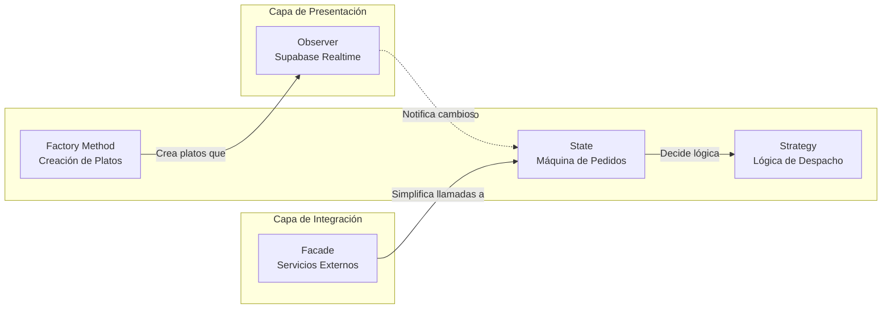

# 04 — Patrones de Diseño: Resumen

El proyecto integra **5 patrones de diseño** que operan en distintos niveles de la arquitectura:

| # | Patrón | Tipo | ¿Dónde actúa? | ¿Qué resuelve? |
|---|---|---|---|---|
| 1 | **Observer** | Comportamiento | Capa de datos → UI | Sincronización en tiempo real sin polling |
| 2 | **State** | Comportamiento | Lógica de negocio | Transiciones válidas del ciclo de vida del pedido |
| 3 | **Factory Method** | Creacional | Panel de Cocina | Creación uniforme de distintos tipos de plato |
| 4 | **Strategy** | Comportamiento | Lógica de despacho | Reglas diferentes según mesa o para llevar |
| 5 | **Facade** | Estructural | Integraciones externas | Simplificar PayPal, Cloudinary y Brevo |

## Cómo se relacionan

- **Factory** crea platos → **Observer** notifica a los clientes del nuevo menú
- **State** controla el ciclo de vida → **Strategy** decide el despacho según origen
- **Facade** envuelve PayPal y Brevo → **State** recibe el resultado del pago para crear el pedido
