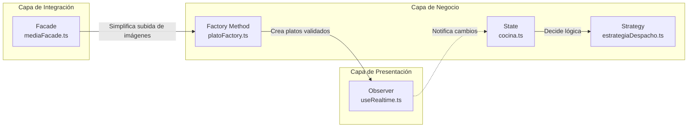

# 04 — Patrones de Diseño: Resumen

El proyecto integra **5 patrones de diseño** que operan en distintos niveles de la arquitectura:

| # | Patrón | Tipo | ¿Dónde actúa? | ¿Qué resuelve? | Archivo principal |
|---|---|---|---|---|---|
| 1 | **Observer** | Comportamiento | Capa de datos → UI | Sincronización en tiempo real sin polling | `src/hooks/useRealtime.ts` |
| 2 | **State** | Comportamiento | Lógica de negocio | Transiciones válidas del ciclo de vida del pedido | `src/lib/acciones/cocina.ts` |
| 3 | **Factory Method** | Creacional | Panel de Cocina | Creación uniforme de distintos tipos de plato | `src/lib/servicios/platoFactory.ts` |
| 4 | **Strategy** | Comportamiento | Lógica de despacho | Reglas diferentes según mesa o para llevar | `src/lib/servicios/estrategiaDespacho.ts` |
| 5 | **Facade** | Estructural | Integraciones externas | Simplificar Wompi, Cloudinary y Brevo | `src/lib/servicios/PagoFacade.ts` |

## Dónde está cada patrón en el código

### Observer
```
src/lib/servicios/realtimeService.ts       ← Abstracción DIP: IServicioRealtime + SupabaseRealtimeService
src/hooks/useRealtime.ts                   ← Hook genérico: infraestructura WebSocket (recibe IServicioRealtime)
src/hooks/usePedidosRealtime.ts            ← Hook de negocio: INSERT + UPDATE + fetch items de pedidos
src/hooks/usePlatosRealtime.ts             ← Hook de negocio: INSERT + UPDATE + DELETE de platos
src/hooks/useMiPedidoRealtime.ts           ← Hook de negocio: UPDATE filtrado por ID del pedido
src/components/cocina/kanbanPedidos.tsx     ← Consumidor UI (kanban)
src/components/cocina/statsBar.tsx         ← Consumidor UI (contadores)
src/components/logistica/listaEntregas.tsx  ← Consumidor UI (entregas con filtro estado=eq.listo)
```

### State
```
src/lib/acciones/cocina.ts:6-11       ← TRANSICIONES_VALIDAS (máquina de estados)
src/lib/acciones/cocina.ts:50-65      ← Validación de transición + rol
src/lib/acciones/cocina.ts:67-76      ← Actualización + Strategy
src/types/index.ts                    ← EstadoPedido (enum)
```

### Factory Method
```
src/lib/servicios/platoFactory.ts     ← Interfaz PlatoCreador + 3 clases + factory
src/hooks/useGestionPlatos.ts:20-23   ← Integración: validar antes de crear
src/components/cocina/FormularioPlato.tsx ← Renderizado condicional por tipo
src/types/index.ts                    ← TipoPlato (enum)
```

### Strategy
```
src/lib/servicios/estrategiaDespacho.ts ← Interfaz + DespachoMesa + DespachoParaLlevar + factory
src/lib/acciones/cocina.ts:73-76      ← Integración: ejecutar al entregar
src/types/index.ts                    ← TipoDespacho (enum)
```

### Facade
```
src/lib/servicios/PagoFacade.ts          ← Wompi (implementado ✅)
src/lib/servicios/mediaFacade.ts          ← Cloudinary (implementado ✅)
src/lib/servicios/NotificacionFacade.ts    ← Brevo (implementado ✅)
src/lib/acciones/pago.ts                  ← Usa PagoFacade
src/lib/acciones/imagenes.ts              ← Usa MediaFacade
```

## Cómo se relacionan



- **Factory** (`platoFactory.ts`) valida y crea platos → los platos se reflejan en el catálogo que el cliente ve
- **State** (`cocina.ts`) controla el ciclo de vida del pedido → cuando llega a "entregado", invoca **Strategy**
- **Strategy** (`estrategiaDespacho.ts`) ejecuta la lógica de finalización según tipo de despacho
- **Observer** (`useRealtime.ts`) notifica en tiempo real a cocina y logística de nuevos pedidos
- **Facade** (`mediaFacade.ts`) simplifica la subida de imágenes a Cloudinary desde el Factory

## Relación con principios SOLID

| Patrón | Principio SOLID aplicado |
|---|---|
| **Factory Method** | OCP — Nuevos tipos de plato sin modificar código existente |
| **Strategy** | OCP — Nuevas estrategias de despacho sin modificar `cambiarEstadoPedido` |
| **Observer** | DIP — Los componentes dependen de la abstracción del canal, no de Supabase directamente |
| **Facade** | SRP — Cada fachada tiene una sola razón de cambiar (un servicio externo) |
| **State** | SRP — La máquina de estados está aislada en una sola Server Action |
