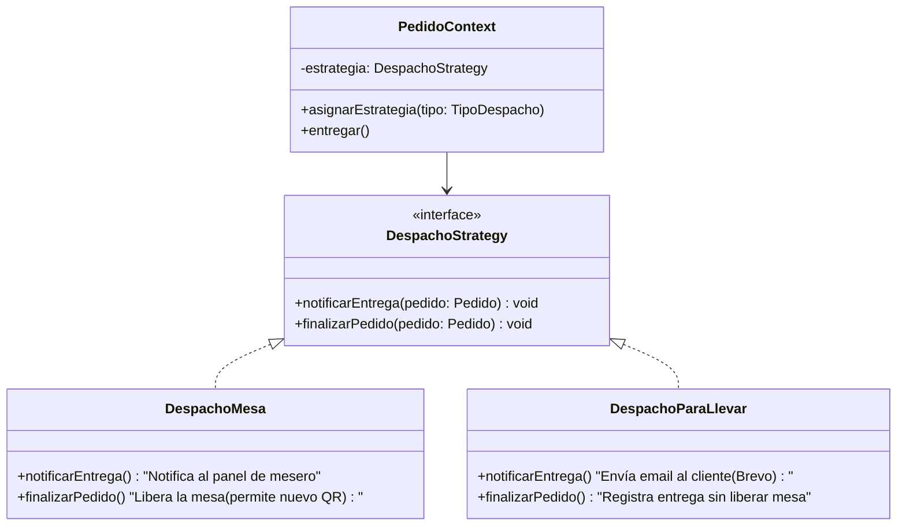

# 04 — Strategy Pattern

## Concepto

El patrón Strategy define una familia de algoritmos, encapsula cada uno y los hace intercambiables. Permite que el algoritmo varíe independientemente de los clientes que lo usan.

## Aplicación en E-Kitchen

El despacho de un pedido puede ser de dos tipos: **en mesa** o **para llevar**. Cada estrategia define reglas diferentes para la logística de entrega sin afectar el flujo principal del pedido.

### Estrategias de despacho

| Estrategia | ¿Quién entrega? | ¿Requiere mesa? | Comportamiento adicional |
|---|---|---|---|
| `mesa` | Mesero a la mesa física | Sí (`mesaId` requerido) | Al entregar, se libera la mesa para nuevos pedidos |
| `para_llevar` | Cliente recoge en mostrador | No (`mesaId` nulo) | Se notifica al cliente por email cuando está listo |

### Cómo funciona

1. El cliente selecciona "Para servir en mesa" o "Para llevar" al iniciar el pedido
2. El sistema asigna la estrategia correspondiente según la selección
3. El flujo de pago y preparación es idéntico para ambas
4. Solo cambia la lógica de notificación y entrega al final

### Referencia en el código

- **Enum de despacho:** `src/lib/db/schema.ts:27` — `tipoDespachoEnum` (`mesa`, `para_llevar`)
- **Tabla pedidos:** `src/lib/db/schema.ts:66-77` — columna `tipoDespacho`
- **Tipos del dominio:** `src/types/index.ts:7` — `TipoDespacho`

### Diagrama

El `PedidoContext` selecciona la estrategia en tiempo de ejecución según `tipoDespacho`. La UI de logística solo llama a `entregar()` sin conocer los detalles de cada estrategia.
