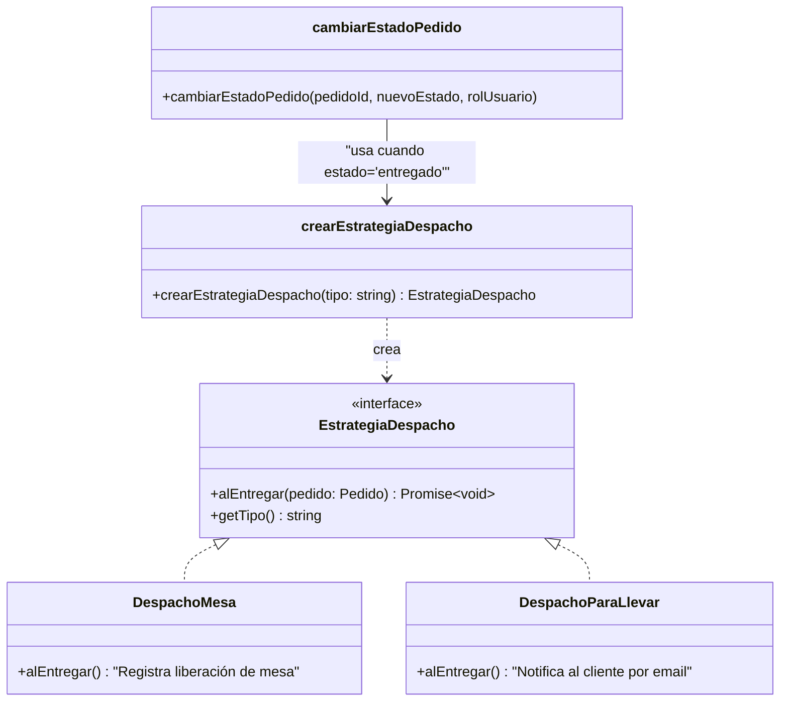

# 04 — Strategy Pattern

## Concepto

El patrón Strategy define una familia de algoritmos, encapsula cada uno y los hace intercambiables. Permite que el algoritmo varíe independientemente de los clientes que lo usan.

## Aplicación en E-Kitchen

El despacho de un pedido puede ser de dos tipos: **en mesa** o **para llevar**. Cada estrategia define reglas diferentes para la logística de entrega sin afectar el flujo principal del pedido.

### Estrategias de despacho

| Estrategia | Clase | ¿Quién entrega? | Comportamiento |
|---|---|---|---|
| Mesa | `DespachoMesa` | Mesero a la mesa física | Al entregar, se registra liberación de mesa |
| Para llevar | `DespachoParaLlevar` | Cliente recoge en mostrador | Al entregar, se notifica al cliente por email |

### Cómo funciona

1. El cliente selecciona "Para servir en mesa" o "Para llevar" al iniciar el pedido
2. El campo `tipo_despacho` se guarda en la tabla `pedidos`
3. Cuando el mesero marca el pedido como "Entregado", la Server Action `cambiarEstadoPedido`:
   - Cambia el estado a `entregado`
   - Llama a `crearEstrategiaDespacho(tipo_despacho).alEntregar(pedido)`
   - Cada estrategia ejecuta su propia lógica de finalización
4. El flujo de pago y preparación es idéntico para ambas estrategias

### Referencia en el código

| Componente | Archivo | Descripción |
|---|---|---|
| **Interfaz + clases** | `src/lib/servicios/estrategiaDespacho.ts` | Define `EstrategiaDespacho` (interfaz), `DespachoMesa`, `DespachoParaLlevar` y la factory `crearEstrategiaDespacho(tipo)` |
| **Integración** | `src/lib/acciones/cocina.ts:68-71` | `cambiarEstadoPedido` ejecuta la estrategia cuando `nuevoEstado === "entregado"` |
| **Enum de despacho** | `src/lib/db/schema.ts` | `tipoDespachoEnum` (`mesa`, `para_llevar`) |
| **Tipos del dominio** | `src/types/index.ts` | `TipoDespacho` |

### Diagrama



### Flujo de ejecución

```typescript
// src/lib/acciones/cocina.ts — cambiarEstadoPedido
if (nuevoEstado === "entregado") {
  // Strategy: ejecutar lógica de despacho según tipo (mesa o para llevar)
  const estrategia = crearEstrategiaDespacho(pedidoActual.tipo_despacho);
  await estrategia.alEntregar(pedidoActual);
}
```

### Beneficio clave

Si mañana se agrega un nuevo tipo de despacho (ej: "delivery a domicilio"), solo se crea una nueva clase `DespachoDomicilio implements EstrategiaDespacho` y se agrega al factory. El código de `cambiarEstadoPedido` y los paneles de UI no se modifican.
